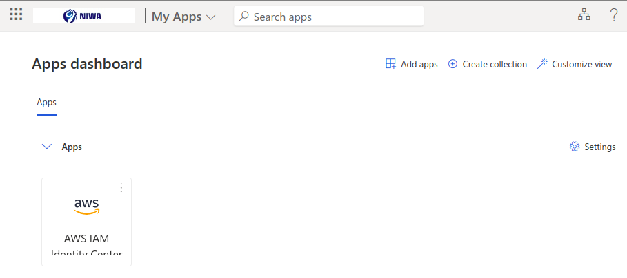
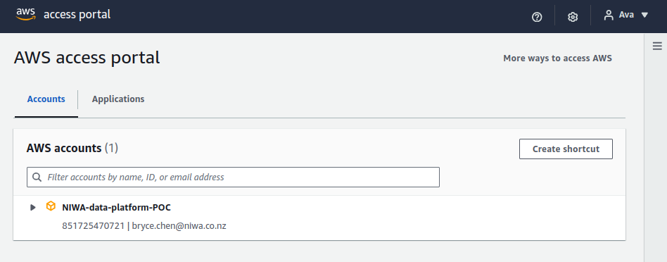
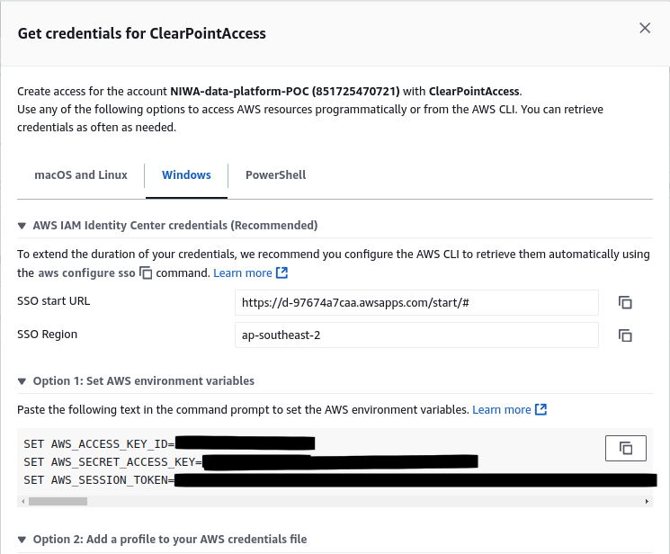

# NIWA Ocean Floor DTIS Data Platform

To manage data operations (data upload, data processing) for the ocean floor DTIS data platform.

## Git repository structure

- [infrastructure](infrastructure/) - contains Terraform code that manages AWS resources (e.g. Amazon S3 buckets)
- [upload](upload/) - contains files needed to upload data to AWS
- [processing](processing/) - contains Lambda function (deployed as Python script in AWS) for the conversion of uploaded (text) files into MongoDB documents

## Demo
1. Make sure the infrastructure is already set up. Please follow the instructions from:
	* [infrastructure/1-terraform-init](infrastructure/1-terraform-init)
	* [infrastructure/2-seafloor-data](infrastructure/2-seafloor-data)
2. Run the data upload software package:
	* [upload/data_upload_prompt.exe](upload/data_upload_prompt.exe)
	* [upload/data_upload_manual.txt](upload/data_upload_manual.txt)
3. The files uploaded to S3 should automatically generate messages in an SQS queue. And the SQS queue should automatically invoke the lambda functions to preprocess the data and ingest to MongoDB, it will also trigger media-convert lambda function if it detects a .m2ts video file format. Feel free to go to Amazon CloudWatch, to read the lambda function log messages.


Cleanup:
* delete the files from the S3 bucket
* you may want to delete the infrastructure, with Terraform

## Running the data upload script

### For the Scientists

Please refer to the data_upload_manual.txt for detailed operations of the software which is designed for Windows OS.
Navigate to /upload folder as well for ReadMe.md to learn more details as well.

1. **Run the Software**. 
	* Set "dry_run" to be "true" to validate the file naming conventions before uploading to the cloud.
2. **Inspect the output**.
	* Please inspect the `plan.txt` file generated. It contains the list of your local files that are going to be uploaded to S3. It also contains the Station ID, parsed from your files paths.  
	* You could also go through the output of the above command, printed in your terminal. The output from the script is also written to the local log files. The log files contain the same information as the terminal output but split across:
		* `error.txt` - contains only warnings and errors
		* `success.txt` - contains successful messages
		* `sync_logs.txt` - contains AWS S3 upload logs

If you are looking for an error message, it might be faster to go look for it in the `error.txt` file, rather than trying to find it in the terminal output.

The file will show you errors, such as:
* a file name did not meet a naming convention
* a file extension was not a real video/image/text file
* there was a problem to deduct the station ID basing on the file path

3. **Edit your local files**. You may need to edit your local files, and run software again with "dry_run" setting to "true", until there are no errors.

4. **Run the Data Upload software again, this time with no dryrun**. If you are happy with the output of the data upload script, the software will prompt you to enter the credentials to upload the data into the cloud.
This will read the contents of `plan.txt` file generated before, and run the actual upload to S3.

### For the Scientists - ignore images and videos

It's possible to not upload the image and video files. In such a case only the text files would be uploaded to S3. To use this feature, just press Enter to skip image_dir and video_dir entries.

### Setting up AWS credentials
1. Log in to https://myapplications.microsoft.com/
You should see the icon titled AWS IAM Identity Center


2. Please click on that icon. It should redirect you to the AWS access portal.



3. Please click on the AWS account named `NIWA-data-platform-POC` and then click on the `Access keys`. You should now see multiple options to choose from.



4. Please select the tab that matches your operating system (e.g. `macOS and Linux`). Then, please copy the credentials provided by `Option 1: Set AWS environment variables`. You should have AWS credentials copied to your clipboard now.

5. Please paste the credentials into the terminal.

6. You may want to test whether it worked (whether you are now authenticated into the correct AWS account) by running:
```
aws sts get-caller-identity
```

The output should be similar to:
```
{
    "UserId": "<your email address here>",
    "Account": "851725470721",
    "Arn": "arn:aws:sts::851725470721:assumed-role/AWSReservedSSO_<the AWS IAM Role name here>"
}
```


## Local testing

### Unit testing with bats-core

[Bats-core](https://github.com/bats-core/bats-core) is a CLI tool, a unit tests framework to verify that the UNIX programs you write behave as expected.

Run it using Docker:

```
./tasks bats
```

Alternative ways to run it:

- running it without Docker. First install Bats using [these instructions](https://bats-core.readthedocs.io/en/stable/installation.html), then run this:

```
bats ./upload/test/bats/*
```

- running the Docker command directly - copy the command from the `tasks` script


### Unit testing with Pytest

Run it locally with:
```
./tasks _lambda_unit_tests
```

Or run it in Docker with:
```
./tasks lambda_unit_tests
```

#### Troubleshooting
If you get a `Permission denied` error, please remove these generated files:
```
rm -r processing/venv/
rm -r processing/results.xml
```
