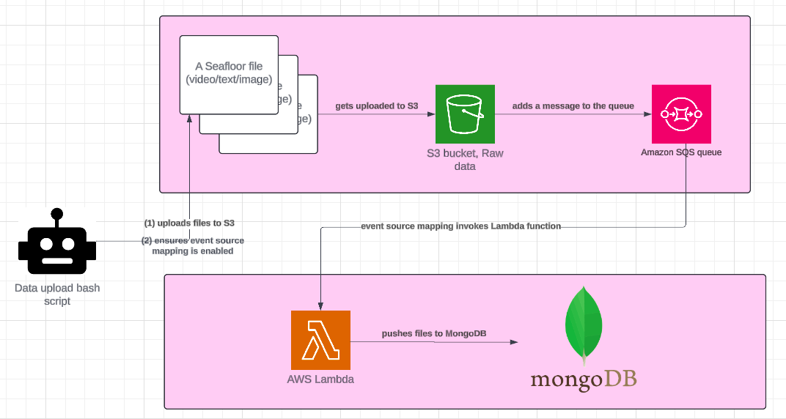

# Architecture

## Aim and requirements/limitations

3 stages to be integrated:
* data upload in Bash script
* data processing using AWS Lambda
* data querying

The Bash script uploads many files (txt, video, images) coming from 1 cruise, into an Amazon S3 bucket. AWS Lambda is supposed to run data processing on the uploaded files. A limitation of AWS Lambda is that it cannot run more than 15 minutes. The data upload may take longer than 15 minutes.

Performance is not a top priority requirement, the solution should rather optimise for cost and simplicity of maintenance.

## Architecture

### AWS Services used
* Amazon S3 bucket - and multi-part upload, and s3 events
* AWS SQS - Standard queue
* Amazon Lambda function - and event source mapping

### The flow

1. The Scientist runs the data upload script. This uploads the seafloor files to S3 and makes sure the Event Source mapping is enabled.
2. The files uploaded to S3 should automatically generate messages in an SQS queue. This uses the S3 `s3:ObjectCreated` events. https://docs.aws.amazon.com/AmazonS3/latest/userguide/notification-how-to-event-types-and-destinations.html
3. The SQS queue automatically invokes the lambda function. This is thanks to the event source mapping.
4. The Lambda function gets the messages from the SQS queue and processes all the files and the log messages are available in Amazon CloudWatch.

### Other considerations

#### DONE - process files in batches
Processing records from a stream or queue **in batches** is more efficient than processing records individually (https://docs.aws.amazon.com/lambda/latest/dg/invocation-eventsourcemapping.html). We cannot use 1 Lambda function, because the processing may take more than 15 minutes.

How could we do it? Use event source mapping. It's a Lambda resource that reads items from stream and queue-based services and invokes a function with batches of records. Lambda is here a consumer of the messages coming from the SQS queue. Lambda can scale and create multiple function invocations (multiple consumers) to handle to load. https://swe.auspham.dev/docs/aws-certified-developer-dva-c01/aws-lambda/lambda-event-source-mapping/

#### TODO/must-have - handle files that could not be processed

Use Dead Letters Queue https://aws.amazon.com/what-is/dead-letter-queue/

#### TODO/must-have - handle potential duplicated events in SQS

The Lambda function must handle the files processing in an **idempotent way**. Lambda event source mappings process each event at least once, and duplicate processing of records can occur. To avoid potential issues related to duplicate events, we strongly recommend that you make your function code idempotent. (https://docs.aws.amazon.com/lambda/latest/dg/with-sqs.html)

How can we do it? We could tag each uploaded S3 object after it is processed:
* 2 options:
	* option 1: use s3 object metadata: https://docs.aws.amazon.com/AmazonS3/latest/userguide/UsingMetadata.html
	* option 2: use object tagging: https://docs.aws.amazon.com/AmazonS3/latest/userguide/object-tagging.html
	* option 3: consider SQS queues of type FIFO
* example key pairs:
	* key1: processed=true or false
		* key2: lock=true or false (true if processed now by some lambda function)

Also, to prevent Lambda from processing a message multiple times, you can either configure your event source mapping to include batch item failures in your function response, or you can use the DeleteMessage API to remove messages from the queue as your Lambda function successfully processes them (https://docs.aws.amazon.com/lambda/latest/dg/with-sqs.html)

#### TODO/must-have - lambda parameters optimisation

There are lots of settings to set with AWS Lambda and SQS. Examples:
* queue's visibility timeout
* lambda configuration timeout
* lambda CPU and memory consumption
* maxReceiveCount
* Batch size, Batch window, Maximum concurrency

> To allow your function time to process each batch of records, set the source queue's visibility timeout to at least six times the configuration timeout on your function. The extra time allows Lambda to retry if your function is throttled while processing a previous batch.

Please read:
* https://docs.aws.amazon.com/lambda/latest/dg/services-sqs-configure.html
* https://docs.aws.amazon.com/lambda/latest/dg/invocation-eventsourcemapping.html#invocation-eventsourcemapping-batching
* https://docs.aws.amazon.com/lambda/latest/dg/lambda-concurrency.html

#### TODO/nice-to-have - potential optimisation, disable event source mapping after processing

*This could be solved by the previous consideration*

There might be a lot of files to be uploaded to S3 at once. Because of that, we might want to delay the processing until after all the files are already uploaded.

How to implement this?
* enable the event source mapping in the data upload script
* disable the event source mapping at the end of the data processing operation (if there is no more messages in the SQS queue)
