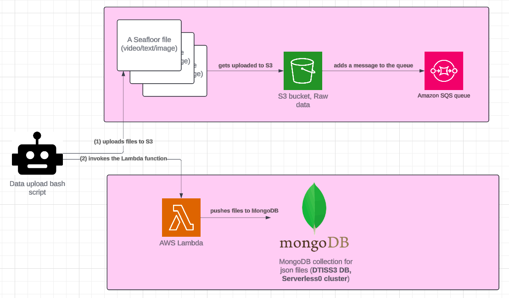
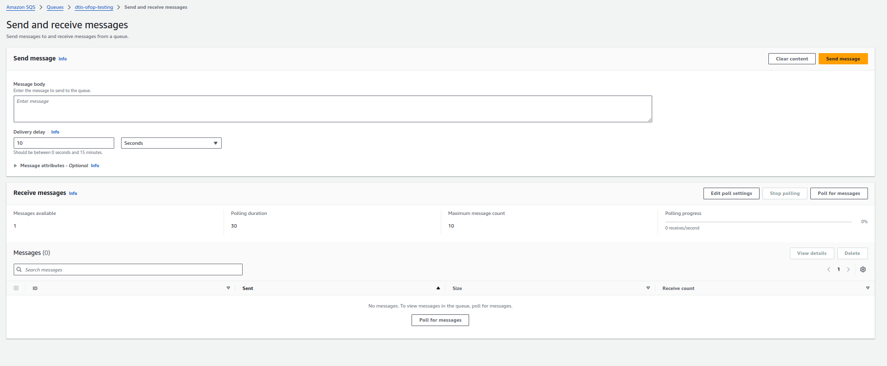
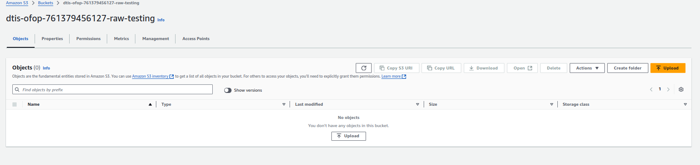
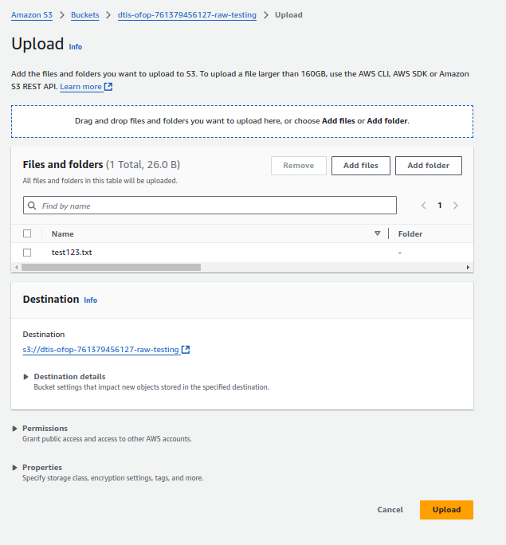
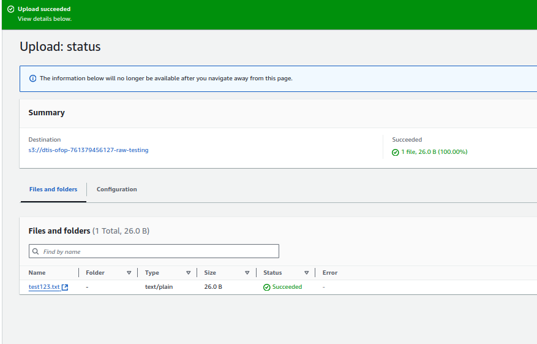
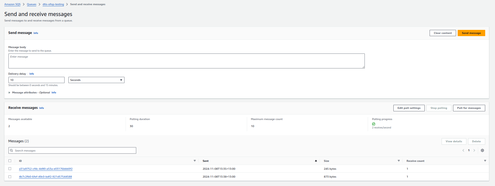
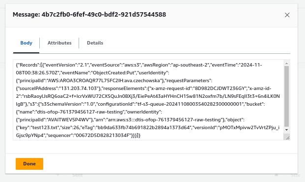

# PoC with AWS SQS

## Aim and requirements/limitations

The aim is to integrate the data upload Bash script with the data processing operation which happens in AWS Lambda.

The Bash script uploads many files (txt, video, images) coming from 1 cruise, into an Amazon S3 bucket. AWS Lambda is supposed to run data processing on the uploaded files. A limitation of AWS Lambda is that it cannot run more than 15 minutes. The data upload may take longer than 15 minutes.

## Architecture for the demo

1. The data upload script uploads the seafloor files to S3.
2. This automatically triggers S3 Events (that a file was uploaded).
3. This automatically results in pushing messages to an SQS queue. The information about each uploaded file is stored as one SQS message.
4. After all the files are uploaded, the data upload script triggers the Lamda function.
5. The Lambda function polls the messages from the SQS queue and processes all the files. (One file per SQS message).

## How to test this

1. Deploy the Terraform code from the [infrastructure](infrastructure) directory.
2. Confirm that S3 bucket and SQS queue were created. There should be 1 message now in the SQS queue.

3. Upload some dummy file to the S3 bucket.

4. Observe how there is a new message in the SQS queue. (You may need to click on "Poll for messages").

